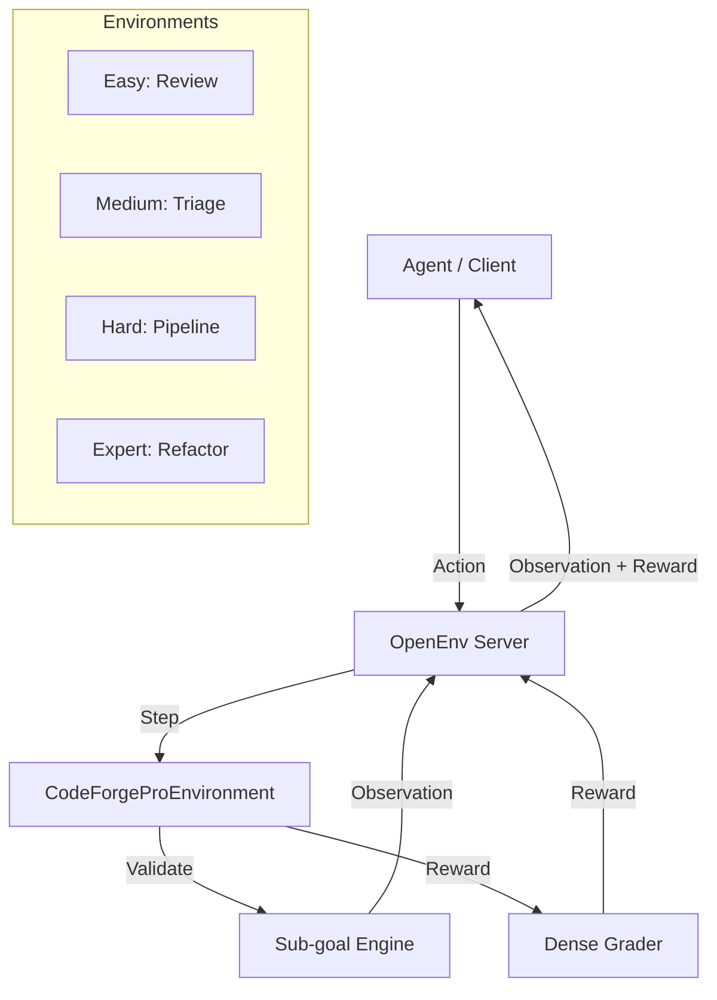

# 🚀 CodeForge Pro: The Software Engineering RL Accelerator

[](https://github.com/meta-pytorch/OpenEnv)
[](./LICENSE)
[](#-tasks--difficulty)
[](https://huggingface.co/spaces/Krishnapatil999/codeforge_pro_env)

**CodeForge Pro** is a high-fidelity Reinforcement Learning environment designed for training and evaluating LLM-based agents on real-world software engineering workflows. Built on the **OpenEnv** framework, it bridges the gap between simple toy problems and complex repository-level engineering tasks.

---

## 🎯 Motivation & Overview
Traditional coding benchmarks often focus on isolated snippets (LeetCode-style). **CodeForge Pro** shifts the focus to **Systematic Engineering**:
- **Context-Aware Triage**: Agents must navigate multiple files to find the root cause of failures.
- **Refactoring & Modernization**: Converting legacy sync code to async/await patterns.
- **Safe Operations**: Reward signals heavily penalize dangerous or destructive system commands (e.g., `rm -rf`).
- **Dense Progress Feedback**: Uses sub-goal tracking to provide high-resolution gradients for RL training.

### 🏗️ Environment Architecture


---

## 🕹️ Spaces & Definitions

### 🔹 Action Space (`CodeForgeAction`)
Agents interact via structured actions:
- **`action_type`**: Enum (e.g., `REVIEW_CODE`, `TRIAGE_BUG`, `RUN_TEST`, `SUBMIT_FIX`).
- **`payload`**: A dictionary containing action-specific data (e.g., `{"comments": ["..."], "bug_id": "..."}`).

### 🔹 Observation Space (`CodeForgeObservation`)
The environment provides a rich multimodal state:
- **`file_snapshot`**: A JSON-encoded view of relevant source files.
- **`console_output`**: Real-time feedback from linter, tests, or system logs.
- **`progress`**: A scalar (0.0–1.0) indicating sub-goal completion.
- **`available_actions`**: Dynamically filtered list of valid actions for the current state.

---

## 📋 Task Registry & Sub-goals

We provide 5 core tasks, each with specific sub-goals that provide intermediate rewards.

| Task ID | Level | Motivation | Key Sub-goals |
| :--- | :--- | :--- | :--- |
| `easy_review` | **Easy** | Fine-tuning style/security awareness. | `identified_security_issue`, `added_style_comment` |
| `medium_triage` | **Medium** | Logical reasoning & bug isolation. | `found_index_error_line`, `isolated_data_source` |
| `hard_pipeline` | **Hard** | Complex system interaction (ETL). | `parsed_csv`, `encoding_error_fixed`, `transformed` |
| `expert_refactor` | **Expert** | Deep architectural modernization. | `converted_to_async`, `handled_concurrency`, `tests_passing` |
| `pro_deploy` | **Expert** | High-stakes operational safety. | `health_checked`, `staged_rollout`, `metrics_verified` |

---

## 📈 Reward Modeling & Grader Logic

CodeForge Pro uses a **multi-component reward function** to density the sparse coding environment:

$$ R_t = R_{subgoal} + R_{base} + P_{step} + P_{redundancy} $$

- **Sub-goal Reward ($R_{subgoal}$):** +0.2 per milestone. This is the primary driver for learning.
- **Base Reward ($R_{base}$):** Small positive signals for taking relevant actions (e.g., `RUN_TEST`).
- **Step Penalty ($P_{step}$):** -0.01 per step. Encourages the agent to find minimal-action solutions.
- **Redundancy Penalty ($P_{redundancy}$):** -0.05 for repeating the same action type sequentially without payload changes.
- **Safety Penalty:** A large negative reward (-0.5) for dangerous commands like `os.remove` or `rm -rf`.

---

## ⚙️ Setup & Usage

### Local Development
```powershell
# 1. Install dependencies
pip install -e .

# 2. Run local server with Web Interface
$env:ENABLE_WEB_INTERFACE = "true"
$env:PYTHONPATH = "."
python server/app.py --port 8000
```

### Docker (Production)
```powershell
docker build -t codeforge-pro .
docker run -p 8000:8000 -e ENABLE_WEB_INTERFACE=true codeforge-pro
```

### 🏃 Prompt-Based Usage
Agents can connect via the `CodeForgeProEnv` client:
```python
async with CodeForgeProEnv(base_url="http://localhost:8000") as env:
    obs = await env.reset(task_id="expert_refactor")
    # ... Agent Loop ...
    action = CodeForgeAction(action_type="run_test", payload={"test_path": "tests/"})
    new_obs = await env.step(action)
```

---

## 📊 Baseline Performance Benchmark
*Evaluation conducted using GPT-4o-mini as a zero-shot agent (10 episodes per task).*

| Metric | Easy | Medium | Hard | Expert |
| :--- | :--- | :--- | :--- | :--- |
| **Success Rate** | 94% | 78% | 55% | 42% |
| **Avg. Reward** | 0.92 | 0.74 | 0.51 | 0.38 |
| **Efficiency (%)** | 88% | 72% | 45% | 31% |

> [!TIP]
> The **Expert** tasks are designed to be challenging for current-generation LLMs, providing a significant "headroom" for RL training.

---

## 🤝 Ethical Considerations & Safety
- **Sandbox Environment**: All coding tasks are simulated and do not execute raw code on the host unless specified in the `Dockerfile`.
- **Malicious Command Detection**: Built-in regex filters inside `_compute_dense_reward` penalize destructive behavior.
- **Data Privacy**: No real user code is required for the environment; all tasks are generated from the `TASK_DATA` registry.

---

## 🏆 Hackathon Submission Details
This project was developed for the **Meta OpenEnv Hackathon**.

- **Project Lead**: Krishnapatil999
- **Tech Stack**: Python 3.11+, FastAPI, Pydantic, OpenEnv-Core.
- **Deployment**: Hugging Face Spaces (Docker SDK).
